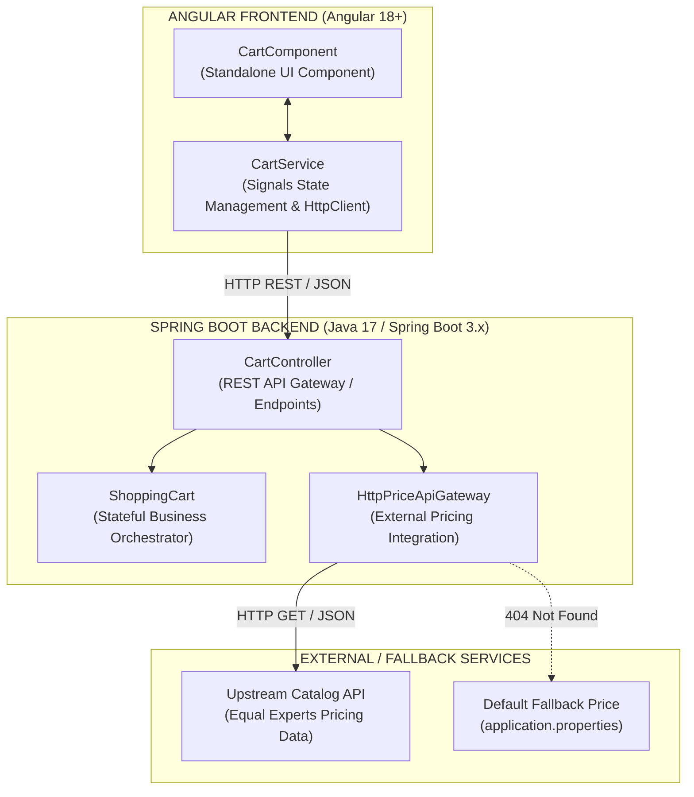
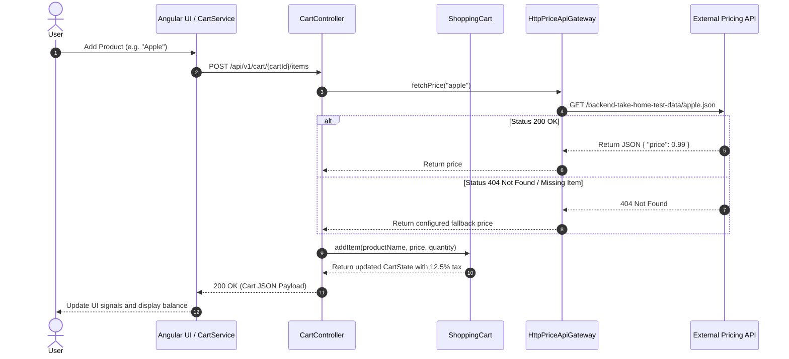
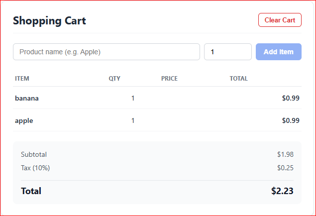

# Stateful Shopping Cart Subsystem

A production-grade, stateful shopping cart backend platform built using **Java 17** and **Spring Boot 3.x**.

The architecture separates the core business domain model from side-effect-heavy external network infrastructure boundaries. The platform orchestrates real-time product data lookup through a remote REST Pricing API and performs precise financial calculations using `BigDecimal` with strict rounding controls.

---

## Key Features

- **Full-Stack Architecture:** Modern Angular 18+ frontend paired with a robust Spring Boot microservice backend.
- **Angular 18+ Signals State Management:** Modern reactive state management using Angular `signal()` and `inject()` functions.
- **Resilient Pricing Gateway:** Integration with an external pricing API providing Equal Experts catalog data.
- **Configurable Fallback Pricing:** Automatically resolves uncatalogued or missing products (`404` responses) using a configurable default price from `application.properties`.
- **Case-Insensitive Item Resolver:** Product names are normalized before price lookup and cart processing.
- **Thread-Safe Concurrent Operations:** Shared cart state is protected against concurrent modifications and verified through dedicated concurrency tests.
- **Precise Financial Calculations:** Monetary calculations use Java `BigDecimal` with explicit scale and rounding rules.

---

## Architecture & System Design



---

## Upstream Price Resolution Sequence



---

## System Component Layout

### 1. Pure Domain Layer

#### `ShoppingCart`

The core stateful business orchestrator.

Responsibilities include:

- Managing cart state.
- Aggregating item quantities.
- Normalizing product names.
- Validating business inputs.
- Calculating subtotal, tax, and total.
- Performing monetary calculations using `BigDecimal`.

#### `CartItem` and `CartState`

Immutable Java records representing cart items and financial breakdown snapshots.

The immutable state representation helps keep cart responses predictable and minimizes accidental state mutation outside the domain aggregate.

---

### 2. External Integration Layer

#### `HttpPriceApiGateway`

A dedicated HTTP integration component responsible for communication with the external pricing service.

Responsibilities include:

- Using Java's native `HttpClient`.
- Serializing and deserializing JSON using Jackson `ObjectMapper`.
- Normalizing product names before external lookup.
- Handling HTTP responses.
- Handling `404 Not Found` responses.
- Applying configurable fallback pricing.
- Isolating external API concerns from the domain model.
- Managing the protocol boundary between the application and the upstream service.

---

### 3. API Controller Layer

#### `CartController`

The REST API entry point for cart operations.

Responsibilities include:

- Exposing REST endpoints.
- Validating HTTP request parameters.
- Resolving product prices through the pricing gateway.
- Invoking the `ShoppingCart` domain component.
- Returning the resulting cart state as JSON.
- Managing cart state lookups.

The controller acts as the application orchestration layer while keeping external HTTP integration and core business calculations separated.

---

## User Interface Overview

The Angular UI provides a reactive, real-time interface for managing the shopping cart.

<div align="center">
  
</div>

---

## REST API Operational Specifications

The system exposes API documentation through **Springdoc OpenAPI 3.x**.

### Swagger UI

When running the application locally, view and interact with the API through:

`http://localhost:8080/swagger-ui/index.html`

Swagger UI provides an interactive dashboard for inspecting and testing the available REST endpoints.

---

### Active Endpoint Routes

| HTTP Verb | Resource Path | Description | Input Parameters | Expected Status Codes |
|---|---|---|---|---|
| **POST** | `/api/v1/cart/{cartId}/items` | Adds a normalized product item to a specific cart | `productName` (String), `quantity` (int) | `200 OK`, `400 Bad Request` |
| **GET** | `/api/v1/cart/{cartId}` | Returns the aggregated cart state and financial totals | `cartId` (Path) | `200 OK`, `404 Not Found` |
| **DELETE** | `/api/v1/cart/{cartId}` | Removes the specified cart from the cart store | `cartId` (Path) | `200 OK`, `404 Not Found` |

### Supported Catalog Products

Supported live catalog items include:

- `cheerio`
- `cornflakes`
- `frosties`
- `shreddies`
- `weetabix`

Any uncatalogued product automatically falls back to the configured default price.

---

## Financial Accounting Parameters

### Taxation

The application uses a fixed tax rate of **12.5%**.

The tax rate is represented internally as:

```text
0.125
```

### Monetary Precision

All monetary calculations use Java `BigDecimal`.

The application enforces:

- **Scale:** 2 decimal places
- **Rounding Mode:** `RoundingMode.HALF_UP`

Using `BigDecimal` avoids the precision issues associated with binary floating-point arithmetic and provides deterministic monetary calculations.

---

## Running the Application

### Backend — Spring Boot

From the backend project directory:

```bash
mvn clean spring-boot:run
```

The backend starts on:

```text
http://localhost:8080
```

---

### Frontend — Angular

From the frontend directory:

```bash
cd shopping-cart-frontend
npm install
ng serve --open
```

The Angular development server will start and open the application in the browser.

---

## Testing Strategy

The codebase implements a comprehensive multi-tier testing strategy focused on business behavior, concurrency, and external integration.

---

### 1. Deterministic Domain Unit Testing

#### `ShoppingCartTest`

Validates the core domain behavior, including:

- Quantity aggregation.
- Product name normalization.
- Input validation.
- Cart state transitions.
- Tax calculation.
- Monetary rounding.
- Edge-case financial calculations.

These tests focus on the domain model and do not depend on external network services.

---

### 2. High-Throughput Concurrency Verification

#### `ShoppingCartConcurrencyTest`

Validates state integrity when multiple threads operate on a shared cart instance concurrently.

The test uses Java concurrency primitives such as `CountDownLatch` to coordinate concurrent operations.

The objective is to ensure that concurrent operations do not result in:

- Lost updates.
- Incorrect item quantities.
- Corrupted cart state.
- Inconsistent financial totals.

---

### 3. Pricing Gateway Integration Testing

#### `HttpPriceApiGatewayIntegrationTest`

Validates the external pricing integration layer.

The integration tests verify:

- Communication with the remote pricing API.
- HTTP response handling.
- JSON response deserialization.
- Successful price resolution.
- `404 Not Found` handling.
- Configured fallback pricing.

> **Note:** These tests communicate with the external pricing service and therefore depend on network connectivity and availability of the upstream API.

---

## Design Principles

The implementation follows several important software engineering principles:

- **Separation of Concerns**
- **Domain-driven business orchestration**
- **Immutable state representation**
- **External integration isolation**
- **Explicit financial precision**
- **Thread-safe state management**
- **Clear API boundaries**
- **Testability**
- **Deterministic business calculations**

The architecture keeps core business rules separated from HTTP and external-service concerns, making the domain logic easier to test, reason about, and evolve.

---

## Technology Stack

### Backend

- **Java 17**
- **Spring Boot 3.x**
- **Spring Web**
- **Jackson**
- **Java `HttpClient`**
- **Springdoc OpenAPI**
- **JUnit**
- **Mockito**
- **Maven**

### Frontend

- **Angular 18+**
- **TypeScript**
- **Angular Signals**
- **Angular HttpClient**
- **Standalone Components**

### Architecture

- Stateful cart domain
- REST API
- External pricing gateway
- Configurable fallback pricing
- Immutable Java records
- Thread-safe concurrent state management
- Multi-layer automated testing

---

## Project Structure

A typical project structure is:

```text
.
├── backend/
│   ├── src/
│   │   ├── main/
│   │   │   ├── java/
│   │   │   │   └── ...
│   │   │   └── resources/
│   │   │       └── application.properties
│   │   └── test/
│   │       └── java/
│   │           └── ...
│   └── pom.xml
│
├── shopping-cart-frontend/
│   ├── src/
│   │   ├── app/
│   │   │   ├── cart/
│   │   │   └── services/
│   │   └── ...
│   ├── package.json
│   └── angular.json
│
├── assets/
│   └── shopping-cart.png
│
└── README.md
```

---

## API Request Example

### Add an Item to the Cart

```http
POST /api/v1/cart/{cartId}/items
Content-Type: application/json
```

Example request:

```json
{
  "productName": "cornflakes",
  "quantity": 2
}
```

The application:

1. Normalizes the product name.
2. Requests the product price from the external pricing API.
3. Applies fallback pricing if the product is unavailable.
4. Adds or aggregates the item in the cart.
5. Calculates subtotal.
6. Calculates 12.5% tax.
7. Calculates the final total.
8. Returns the updated cart state.

---

## Example Price Resolution

For a catalogued product:

```text
Client
  |
  v
CartController
  |
  v
HttpPriceApiGateway
  |
  v
External Pricing API
  |
  +---- 200 OK ----> Product Price
  |
  +---- 404 -------> Configured Fallback Price
```

The fallback mechanism ensures that the cart can continue operating even when a requested product is not available in the upstream catalog.

---

## Financial Calculation Flow

```text
Product Price
     |
     v
Quantity Aggregation
     |
     v
Subtotal
     |
     v
12.5% Tax
     |
     v
Final Total
```

All monetary calculation stages use `BigDecimal` with an explicit two-decimal scale and `RoundingMode.HALF_UP`.

---

## Concurrency Model

The cart subsystem is designed to support concurrent operations against shared cart state.

Concurrent requests may attempt to:

- Add the same product.
- Add different products.
- Increase quantities.
- Read the current cart state.

The concurrency test suite verifies that the resulting cart state remains consistent under concurrent access.

`CountDownLatch` is used in the concurrency test to coordinate multiple worker threads and create deterministic concurrent execution scenarios.

---

## Error Handling

The application handles the following major scenarios:

| Scenario | Handling |
|---|---|
| Missing product name | `400 Bad Request` |
| Invalid quantity | `400 Bad Request` |
| Product available upstream | Use catalog price |
| Product not found upstream | Use configured fallback price |
| Existing cart | Update existing cart state |
| Unknown cart on GET | `404 Not Found` |
| Unknown cart on DELETE | `404 Not Found` |
| External pricing response | Gateway handles HTTP response and serialization boundary |

---

## Configuration

Fallback pricing is configured through Spring Boot configuration.

Example:

```properties
cart.default-price=0.99
```

This allows the fallback price to be changed without modifying the domain implementation.

---

## Observability and Integration Boundaries

The external pricing gateway provides a clear boundary between the internal application and the remote pricing service.

This separation allows the application to:

- Keep external HTTP concerns outside the domain model.
- Isolate serialization/deserialization logic.
- Handle upstream failures independently.
- Configure fallback behavior.
- Test the domain without network dependencies.
- Replace the external pricing implementation without changing core cart logic.

---

## Summary

The Stateful Shopping Cart Subsystem demonstrates a production-oriented approach to building a modern full-stack application using:

- **Java 17**
- **Spring Boot 3.x**
- **Angular 18+**
- **Angular Signals**
- **REST APIs**
- **Java `HttpClient`**
- **Jackson**
- **BigDecimal**
- **Thread-safe state management**
- **External service integration**
- **Configurable fallback behavior**
- **OpenAPI / Swagger**
- **Unit and integration testing**
- **Concurrent execution testing**

The architecture intentionally separates the **business domain**, **REST/API orchestration**, and **external infrastructure integration**, providing a clean foundation for maintainability, testing, and future evolution.
